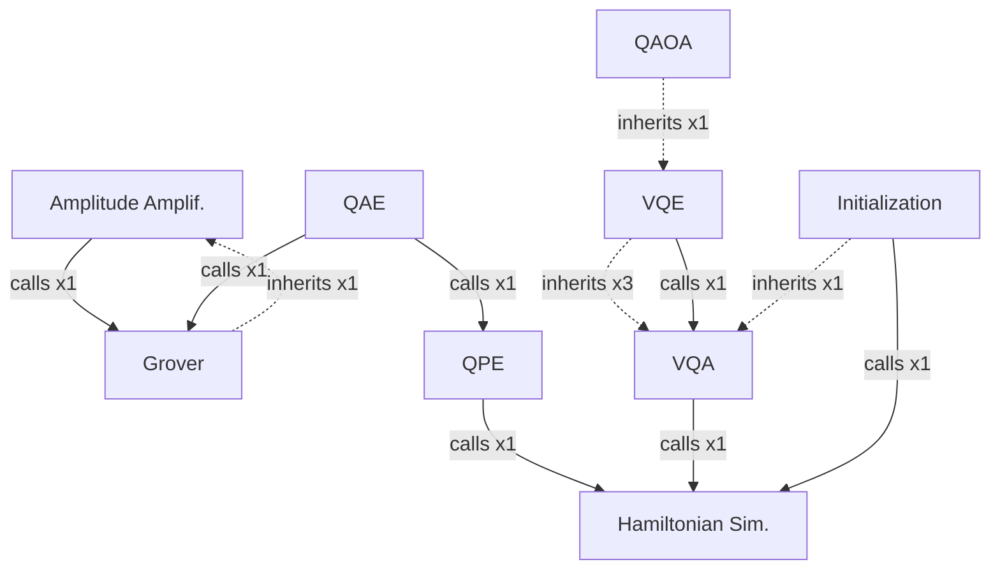

# Composition Graph — Pattern Level

```mermaid
flowchart TD
    N0["Amplitude Amplif."]
    N1["Grover"]
    N2["Hamiltonian Sim."]
    N3["Initialization"]
    N4["QAE"]
    N5["QAOA"]
    N6["QPE"]
    N7["VQA"]
    N8["VQE"]

    N8 -.->|inherits x3| N7
    N0 -->|calls x1| N1
    N1 -.->|inherits x1| N0
    N4 -->|calls x1| N6
    N4 -->|calls x1| N1
    N8 -->|calls x1| N7
    N5 -.->|inherits x1| N8
    N6 -->|calls x1| N2
    N7 -->|calls x1| N2
    N3 -->|calls x1| N2
    N3 -.->|inherits x1| N7
```